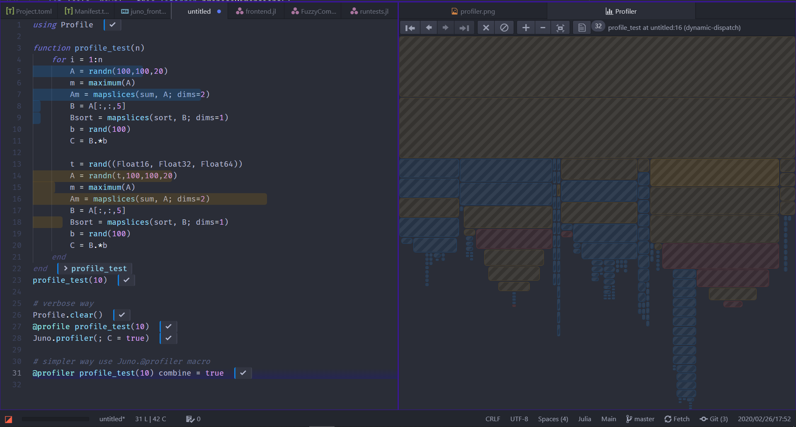

# The Juno.jl Front-End

Juno provides some functionality using Atom's UI, which will usually have a
fallback for use in other environments.

The `isactive()` function will provide an interface for figuring out whether the
current session is running within Juno:

```@docs
Juno.isactive
```

## Enhanced Display

Juno.jl includes features which allow package developers to create enhanced displays
in Juno.

For example, we can print provide structured display for arbitrary objects (similar to `Base.dump`)


```@docs
Juno.structure
```

## Profiler

Profiles collected by `Profile.@profile` can be displayed as a flame chart
(similar to [`ProfileView.jl`](https://github.com/timholy/ProfileView.jl))
inside of Juno by calling `Juno.profiler`.
There's also a `Juno.@profiler` macro which does the same as `Profile.@profile`
but also displays the collected information as a flame chart after clearing all the collected backtraces beforehand.
Just using the `Juno.@profiler` macro will be enough for most cases.

```@docs
Juno.profiler
Juno.@profiler
```



Clicking on one of the boxes in the profile view will take you to the corresponding file/line.
The width of the boxes in the profile view and the length of the lines in the editor
correspond to the percentage of calls made in that line.
Also note that there are specially colored lines:
- yellow means the line was dynamically dispatched
- red means there was a garbage collection happened at the line

!!! tip
    See [the performance tips](https://docs.julialang.org/en/v1.5-dev/manual/performance-tips/#Avoid-changing-the-type-of-a-variable-1) or
    [this thread](https://discourse.julialang.org/t/dynamic-dispatch/6963)
    for how/why dynamic dispatch can affect the performance.

To clear the profile view and the in-editor display,
click the `Forget Plot` button in the profile view toolbar or use `Julia Client: Clear Profile` command.

## Progress Meters

Juno.jl allows package developers to use the progress bar which is provided in the
Atom window. For example, you can easily show a progress meter for a `for` loop
or a comprehension via the command:

```julia
@progress for ...
```


The following functions provide this interface:

```@docs
Juno.@progress
Juno.progress
```

It is recommended to either use the `@progress` macro or the
```julia
progress(name = "Foo") do p

end
```
notation to ensure that the progress bars are properly unregistered in the
frontend.

## Interaction

Juno.jl lets package developers interact with users via the Atom frontend.

### `Juno.selector`

allows the user to select from a list of options:

```@docs
Juno.selector
```


### `Juno.notify`

sends an OS-level notification:

```@docs
Juno.notify
```

### `Juno.notification`

sends an notification via Atom's builtin notification API:

```@docs
Juno.notification
```

### `Juno.syntaxcolors`

queries the currently used syntax colors in Atom (, which can be used to generate
[a plot theme](https://github.com/JuliaPlots/PlotThemes.jl/blob/81ce6ef995aef2efe94ae2ef8e3a20d5f823d6cd/src/juno_smart.jl) or
[an OhMyREPL syntax theme](https://github.com/JunoLab/Juno.jl/issues/15#issuecomment-357704377) from that, etc).

```@docs
Juno.syntaxcolors
```

!!! note "example usecases"
    - plot theme: [`Plots.theme(:juno)`](https://github.com/JuliaPlots/PlotThemes.jl/blob/81ce6ef995aef2efe94ae2ef8e3a20d5f823d6cd/src/juno_smart.jl#L17) automatically create a plot theme based on your Atom syntax color, using this function internally
    - [OhMyREPL.jl](https://github.com/KristofferC/OhMyREPL.jl) theme: the package doesn't not provide an integrated theme by default, but here are snippets you can create its theme based on your Atom syntax theme:
      + https://github.com/JunoLab/Juno.jl/issues/15#issuecomment-357704377
      + https://github.com/aviatesk/avi-atom/blob/f752e8efd8f3d68e5cd1e1f948562c5d237415e8/scripts/junostartup.jl

### `Juno.clearconsole`

clears the Juno REPL:

```@docs
Juno.clearconsole
```

!!! note
    you can clear any Juno terminal via `Ctrl-J Ctrl-C` (i.e. `Julia Client: Clear REPL` command).
