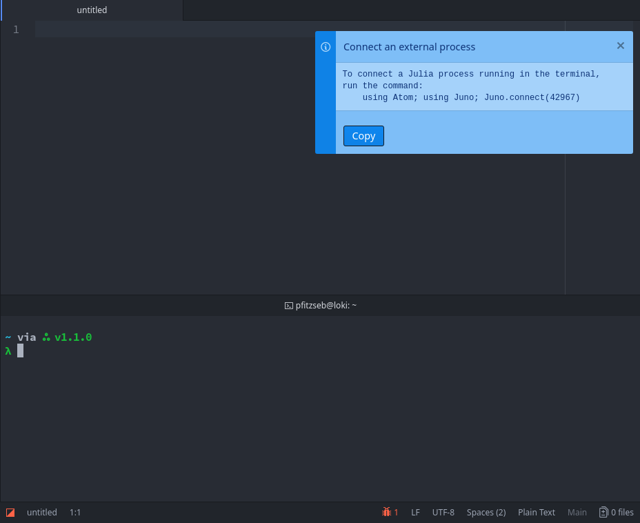
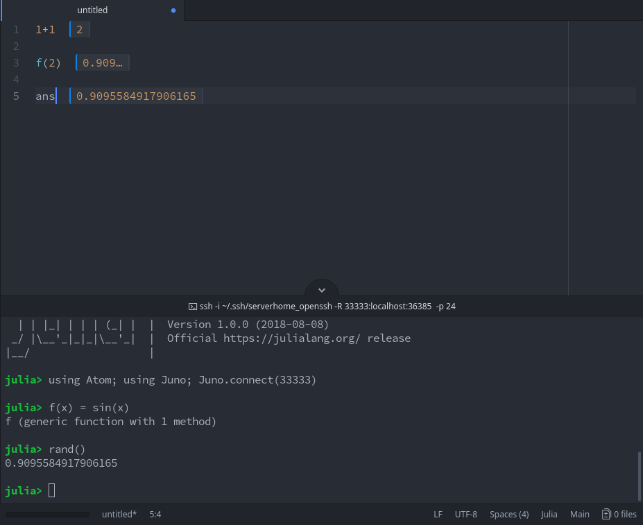

# Connecting to a Julia session on a remote machine

Juno can be used for editing and executing code on a remote machine (which might be very useful for computationally expensive tasks or when you want to use hardware not available locally, e.g. GPUs).

### Prerequisites

The remote machine must have Julia installed and you need to be able to open a ssh connection to it. On your local machine you need a working Juno installation as well as [`ftp-remote-edit`](https://github.com/h3imdall/ftp-remote-edit) for editing remote files.

## Setup
Add a new server in `ftp-remote-edit`'s server browser with the `Ftp Remote Edit: Edit Servers` command:


Select that server in the "Remote" tree view and click the planet icon in the toolbar to start a Julia session on the selected remote machine. If you want to start a remote session by default then you can change the `Boot Mode` to `Remote` in the julia-client settings.


If you have `tmux` installed on the server then you can also use a persistent session, which you can connect to and disconnect from at will without losing progress. To use this feature enable the `Use
persistent tmux session` option in the julia-client settings.
Note that using `tmux` changes the behavior of the console, affecting scrolling and copy/paste.
See [the manual page](https://man.openbsd.org/OpenBSD-current/man1/tmux.1#DEFAULT_KEY_BINDINGS) for more information.

### Advanced usage

If you have a more elaborate setup on the remote server, you can take control of
the various stages of launching a remote julia session.

#### Customizing the command to launch julia

The command to launch julia can be replaced with a custom script that finishes with
launching julia. This can be useful if you don't have julia installed directly on
the server, but inside a container, or if you need some job scheduling script
to start julia. For this task put the path to your custom script as the
command to execute Julia on the remote server


where `julia.sh` can be something like
```bash
# do setup
/usr/bin/julia "$@"
```
The important part is to use `"$@"` in order to pass the arguments to Julia required to start Juno
and of course to guarantee that at the end of the script a Julia session will be opened.
For example, to launch Julia in a singularity container on the remote, something like the following can be used
```bash
export JULIA_NUM_THREADS="$(( `nproc` / 2 ))"
singularity exec /path/to/singularity/image/julia.sif /usr/local/julia/bin/julia -O 3 "$@"
```

#### Manual port forwarding

Internally Juno uses a [ssh nodejs library](https://github.com/mscdex/ssh2)
to establish the connection with the remote server.
You can manually connect to the remote server and use port forwarding to
connect Juno to the remote session. This can be useful if you need more control
over the connection layer. One example would be needing to restart Julia without
reestablishing the ssh connection.

##### On the local machine:

Open a new terminal in Juno with `Julia Client: New Terminal` and execute the
`Julia Client: Connect External Process` command in Juno:



In the terminal you'll need to `ssh` into the remote machine with port forwarding.
This can be done with the following command
```
ssh -R <RemotePort>:localhost:<JunoPort> you@yourserver
```
where `<RemotePort>` is a port you can choose freely and `<JunoPort>` is the port given by the `Connect External Process` command.
The `<JunoPort>` can also be customized in the settings.

For servers that listen on a non-standard `ssh` port you'll also need to add the correct `-p` flag;
I'd also recommend using an identity file with the `-i` option.


##### On the remote machine:

After you're successfully logged into the server you need to start Julia, potentially `pkg> add Atom Juno`, and execute
```
using Atom; using Juno; Juno.connect(<RemotePort>)
```
You should get a message telling you that Juno successfully connected to an external process;
after that basically all of Juno's features should work fine:


